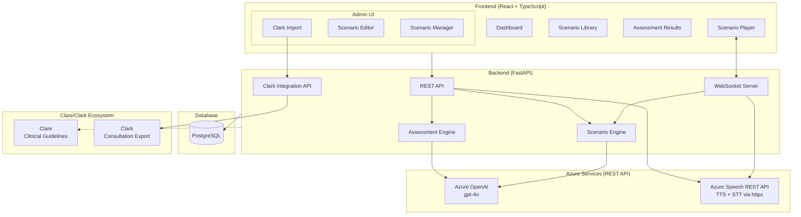
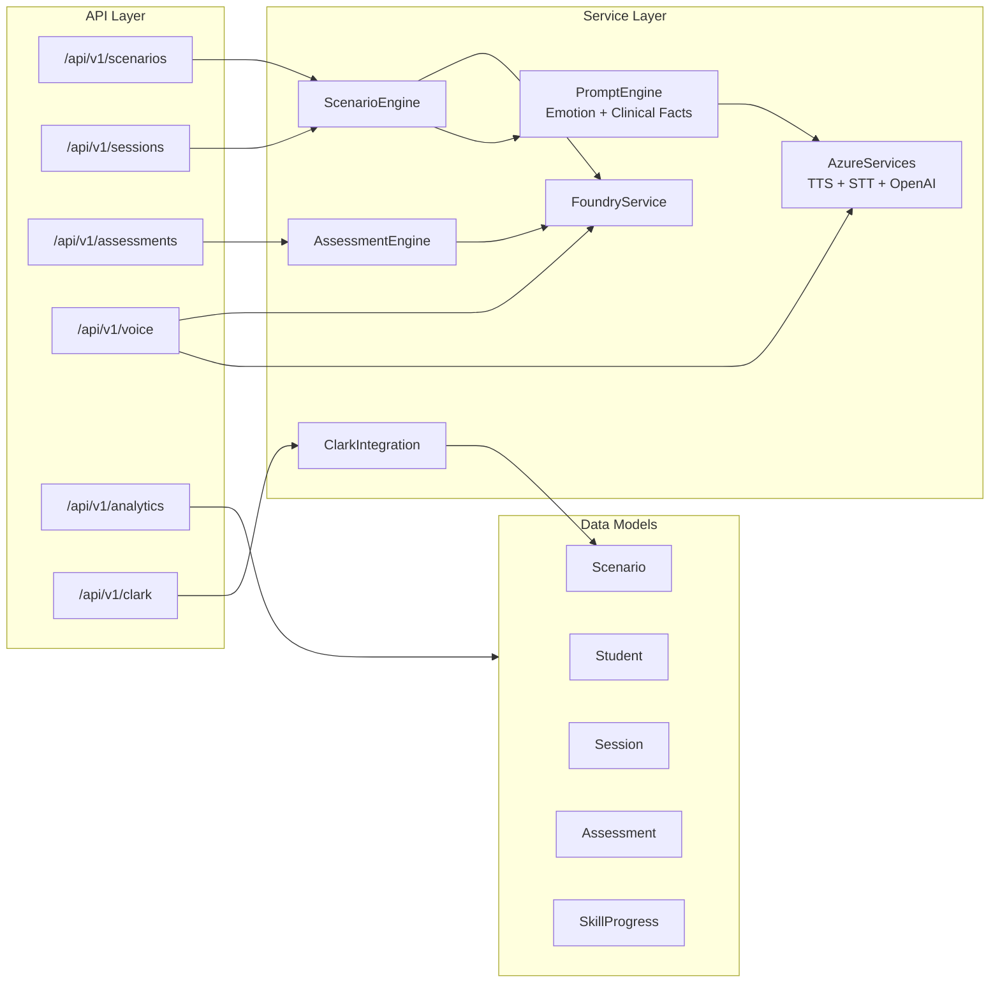
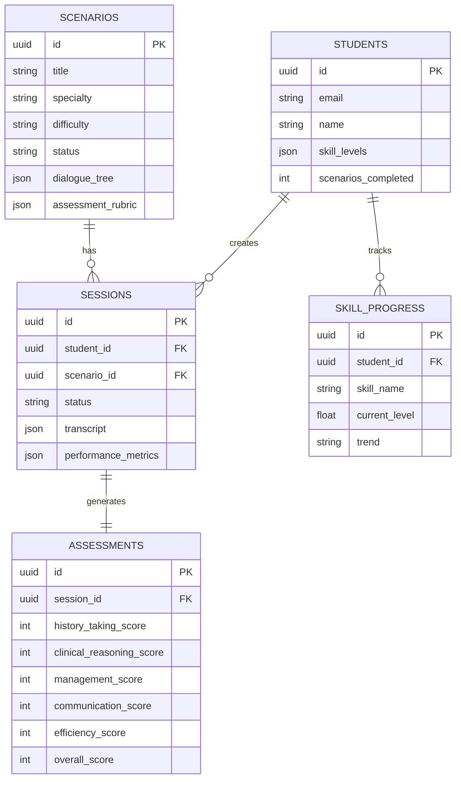
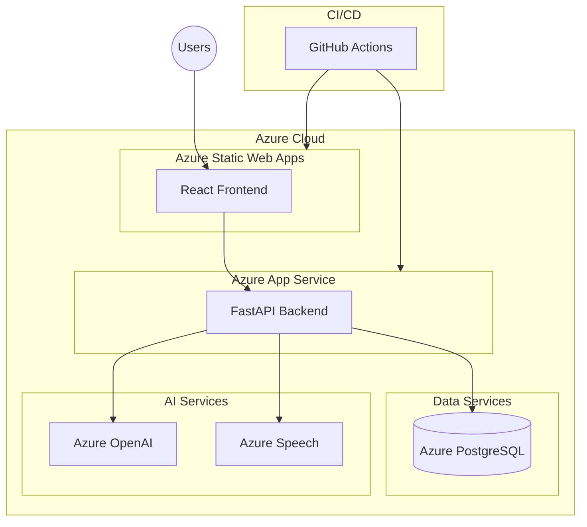
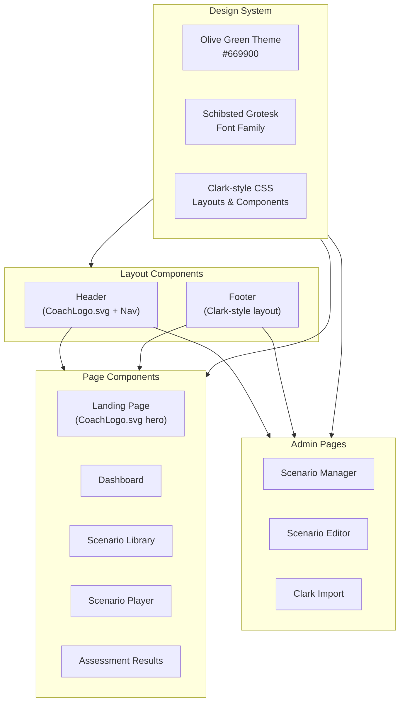
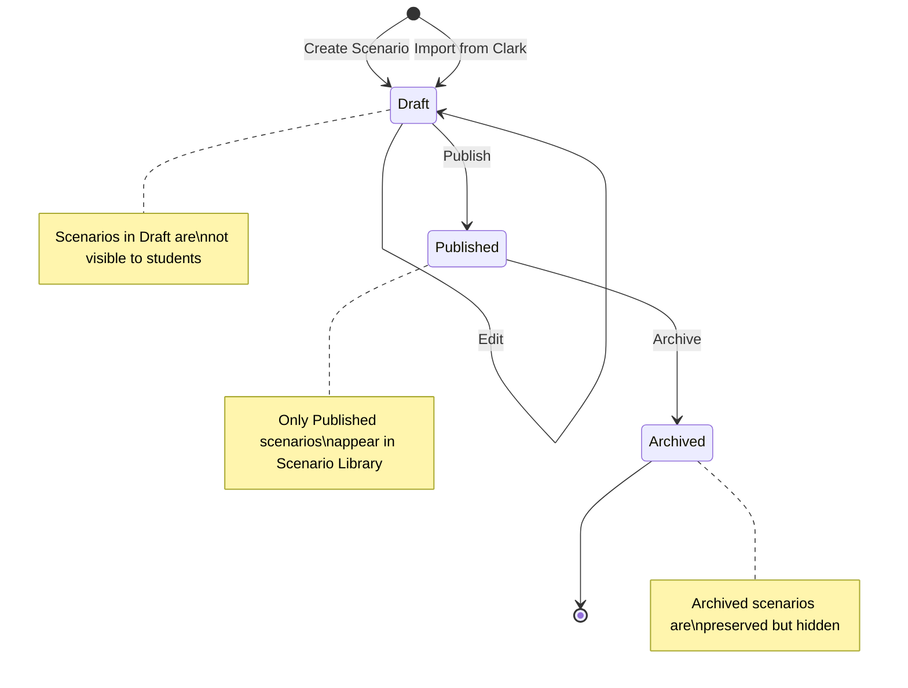
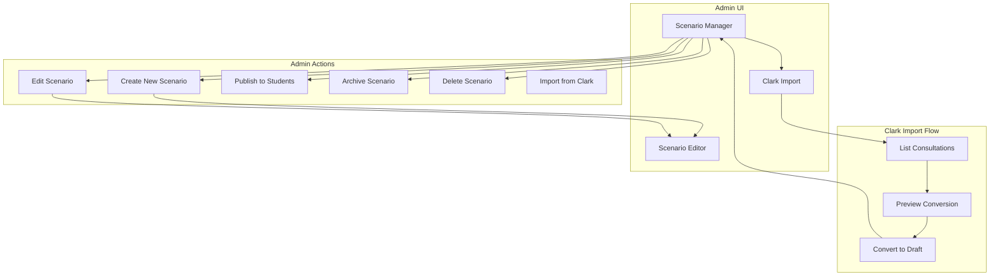
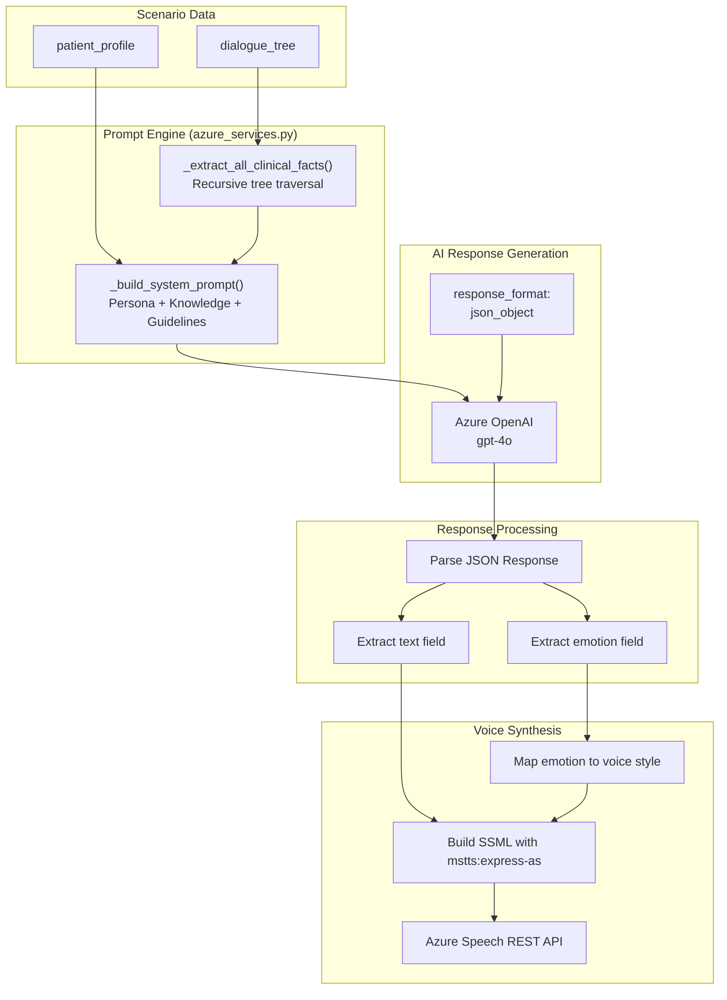

# Coach AI System Architecture

**Last Updated**: 2025-11-24

## Overview

Coach AI is a clinical training platform for medical students, integrating with the Clare (guidelines) and Clark (transcription) ecosystem.

## UI Design System

Coach AI uses a Clark-inspired design system for visual consistency across the Clare/Clark/Coach ecosystem.

### Branding

- **Logo**: CoachLogo.svg (SVG vector logo used in Header and Landing page)
- **Color Theme**: Olive green (#669900) - replaces previous NHS blue palette
- **Typography**: Schibsted Grotesk (matching Clark design)

### Color Palette

| Token | Value | Usage |
|-------|-------|-------|
| `primary-500` | #669900 | Main olive green, buttons, active states |
| `primary-600` | #527a00 | Hover states, darker accents |
| `primary-50` | #f4f7e9 | Light backgrounds, active nav items |
| `coach-olive` | #669900 | Brand color alias |
| `coach-olive-light` | rgba(102,153,0,0.1) | Subtle backgrounds |

### Layout Components

| Component | Description |
|-----------|-------------|
| **Header** | Coach SVG logo (left), Navigation links (center), User menu (right) |
| **Footer** | Clark-style layout - copyright text (left), policy/terms links (right) |

## High-Level Architecture

## Component Architecture

## Database Schema

## Deployment Architecture

## Technology Stack

| Layer | Technology |
|-------|------------|
| Frontend | React 18, TypeScript, Vite, Tailwind CSS |
| UI Design | Clark-style CSS, Schibsted Grotesk font, Olive green (#669900) theme |
| Backend | FastAPI, Python 3.11, SQLAlchemy 2.0 |
| Database | PostgreSQL 15 |
| AI | Azure OpenAI (gpt-4o), Azure Speech REST API (TTS/STT via httpx) |
| Infrastructure | Docker (ARM64/AMD64), Azure App Service, GitHub Actions |

## Frontend Component Architecture

## Scenario Status Workflow

## Admin Workflow

## Key Architecture Notes

- **Azure Speech Services**: Uses REST API directly via httpx instead of the azure-cognitiveservices-speech SDK. This provides cross-platform compatibility (ARM64/AMD64) and works reliably in Docker containers.
- **WebSocket Integration**: The WebSocket endpoint loads scenarios from the database, creates a ScenarioEngine instance, and generates patient responses via Azure OpenAI. TTS audio is sent as base64-encoded data over the WebSocket connection.
- **Scenario Status Workflow**: Scenarios follow a Draft -> Published -> Archived lifecycle. Only Published scenarios are visible to students in the Scenario Library.
- **Clark Integration**: The Clark API (`/api/v1/clark`) enables importing anonymized consultations as Draft scenarios for review before publishing.
- **AI Prompt & Emotion Engine**: The system builds comprehensive patient personas with clinical knowledge extracted from the entire dialogue tree. AI responses include dynamic emotion tags that map to Azure Speech voice styles.

## AI Prompt & Emotion Engine

The AI subsystem provides realistic patient simulation with dynamic emotional responses.

### Supported Emotions

| Emotion | Azure Voice Style | Use Case |
|---------|-------------------|----------|
| `neutral` | `general` | Normal conversation |
| `cheerful` | `cheerful` | Good news, positive updates |
| `sad` | `sad` | Disappointment, bad news |
| `angry` | `angry` | Frustration, upset |
| `fearful` | `worried` | Anxiety about symptoms |
| `terrified` | `worried` | Severe fear, panic |
| `hopeful` | `hopeful` | Optimism about treatment |
| `shouting` | `shouting` | Urgency, distress |
| `whispering` | `whispering` | Confidential information |
| `unfriendly` | `unfriendly` | Uncooperative patient |
