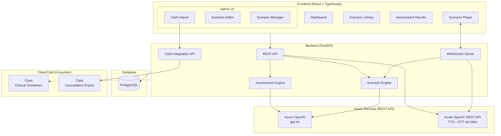
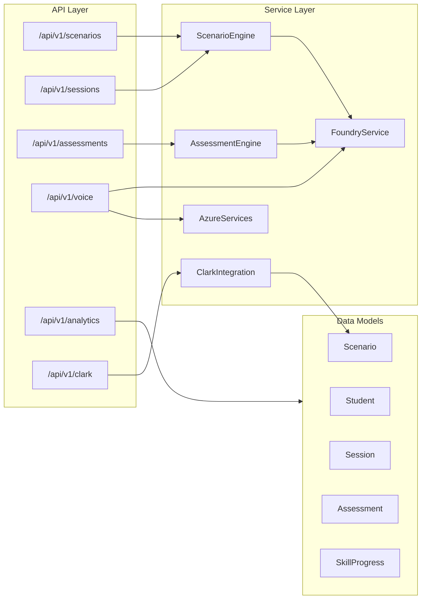
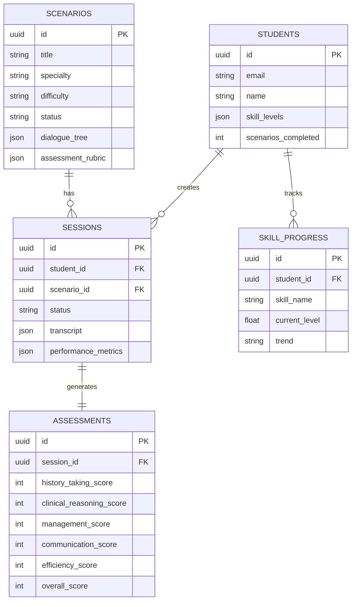
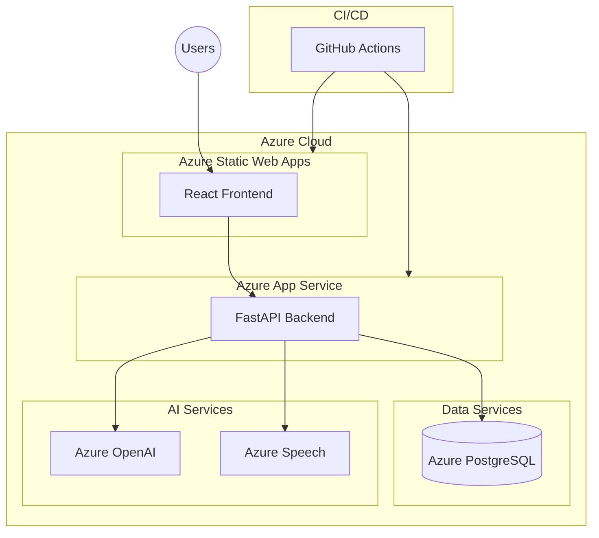
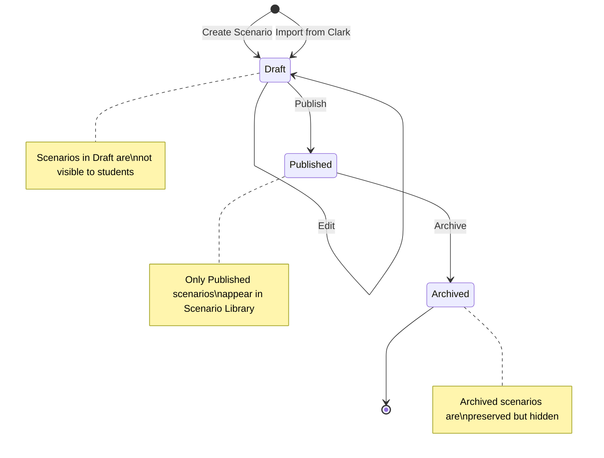
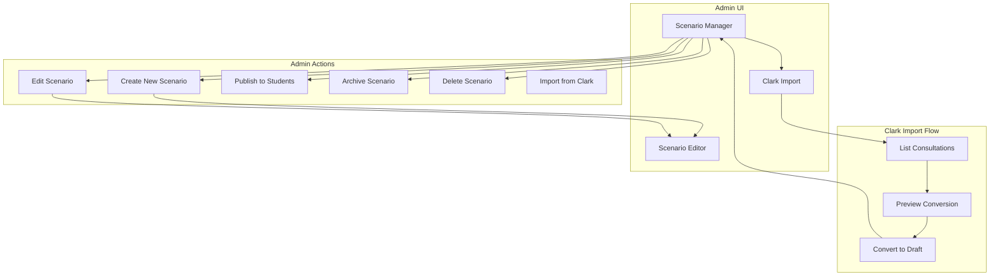

# Coach AI System Architecture

**Last Updated**: 2025-11-23

## Overview

Coach AI is a clinical training platform for medical students, integrating with the Clare (guidelines) and Clark (transcription) ecosystem.

## High-Level Architecture

## Component Architecture

## Database Schema

## Deployment Architecture

## Technology Stack

| Layer | Technology |
|-------|------------|
| Frontend | React 18, TypeScript, Vite, Tailwind CSS |
| Backend | FastAPI, Python 3.11, SQLAlchemy 2.0 |
| Database | PostgreSQL 15 |
| AI | Azure OpenAI (gpt-4o), Azure Speech REST API (TTS/STT via httpx) |
| Infrastructure | Docker (ARM64/AMD64), Azure App Service, GitHub Actions |

## Scenario Status Workflow

## Admin Workflow

## Key Architecture Notes

- **Azure Speech Services**: Uses REST API directly via httpx instead of the azure-cognitiveservices-speech SDK. This provides cross-platform compatibility (ARM64/AMD64) and works reliably in Docker containers.
- **WebSocket Integration**: The WebSocket endpoint loads scenarios from the database, creates a ScenarioEngine instance, and generates patient responses via Azure OpenAI. TTS audio is sent as base64-encoded data over the WebSocket connection.
- **Scenario Status Workflow**: Scenarios follow a Draft -> Published -> Archived lifecycle. Only Published scenarios are visible to students in the Scenario Library.
- **Clark Integration**: The Clark API (`/api/v1/clark`) enables importing anonymized consultations as Draft scenarios for review before publishing.
