# Assessment Engine Flow

**Last Updated**: 2025-11-24

## Overview

The Assessment Engine evaluates student performance across five clinical competencies and generates detailed feedback.

## Assessment Generation Flow

## Scoring Algorithm

## Skill Scoring Criteria

### History Taking (30%)

### Clinical Reasoning (25%)

| Factor | Weight | Measurement |
|--------|--------|-------------|
| Diagnosis Accuracy | 50% | Correct vs. incorrect |
| Differential Thinking | 30% | Questions suggesting alternatives |
| Pattern Recognition | 20% | Identifying key symptoms |

### Management (20%)

| Factor | Weight | Measurement |
|--------|--------|-------------|
| Treatment Plan | 40% | Appropriate interventions |
| Referral Decision | 30% | Correct escalation |
| Safety Netting | 30% | Red flag awareness |

### Communication (15%)

| Factor | Weight | Measurement |
|--------|--------|-------------|
| Empathy | 40% | Patient-centered language |
| Clarity | 35% | Clear questions |
| Professional Tone | 25% | Appropriate language |

**Note**: The conversation history now includes emotion data from patient responses (e.g., `fearful`, `terrified`, `sad`). This emotion data can be used for future enhancements to assess how students respond to emotionally distressed patients.

### Efficiency (10%)

| Factor | Weight | Measurement |
|--------|--------|-------------|
| Time Management | 50% | Session duration |
| Question Efficiency | 50% | Relevant questions ratio |

## Skill Progress Tracking

## Feedback Generation

```mermaid
flowchart LR
    subgraph Scores
        S1[History: 85]
        S2[Reasoning: 70]
        S3[Management: 75]
        S4[Communication: 90]
        S5[Efficiency: 65]
    end

    subgraph Analysis
        High[High Scores\n≥80]
        Medium[Medium Scores\n60-79]
        Low[Low Scores\n<60]
    end

    subgraph Feedback
        Strengths[Strengths List]
        Improve[Improvements List]
        Recommend[Recommendations]
    end

    S1 --> High
    S4 --> High
    S2 --> Medium
    S3 --> Medium
    S5 --> Medium

    High --> Strengths
    Medium --> Improve
    Low --> Improve

    Strengths --> Recommend
    Improve --> Recommend
```

