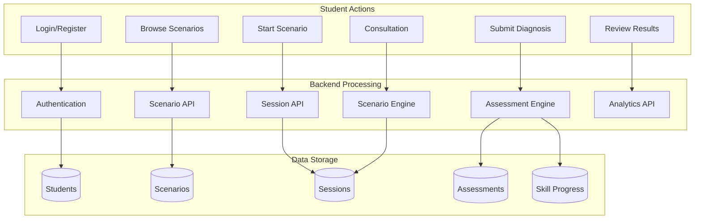
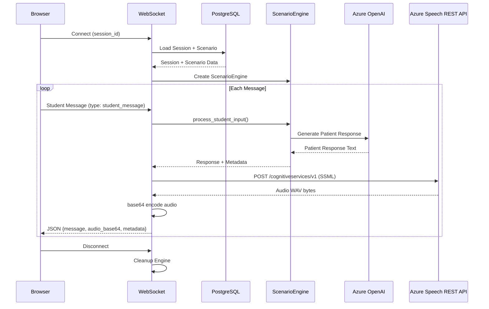
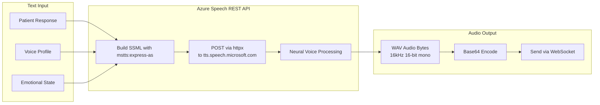
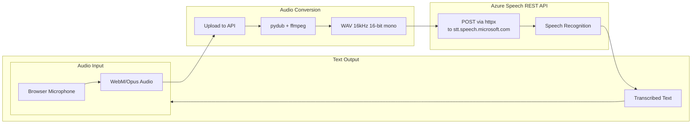
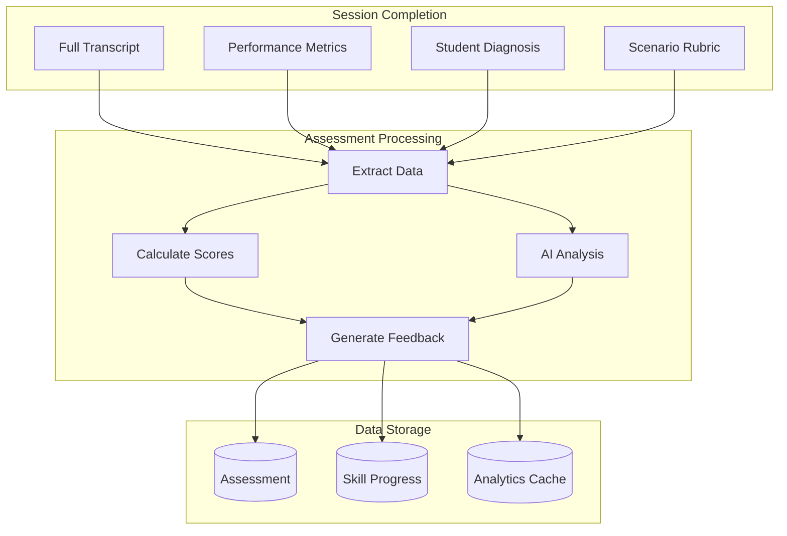
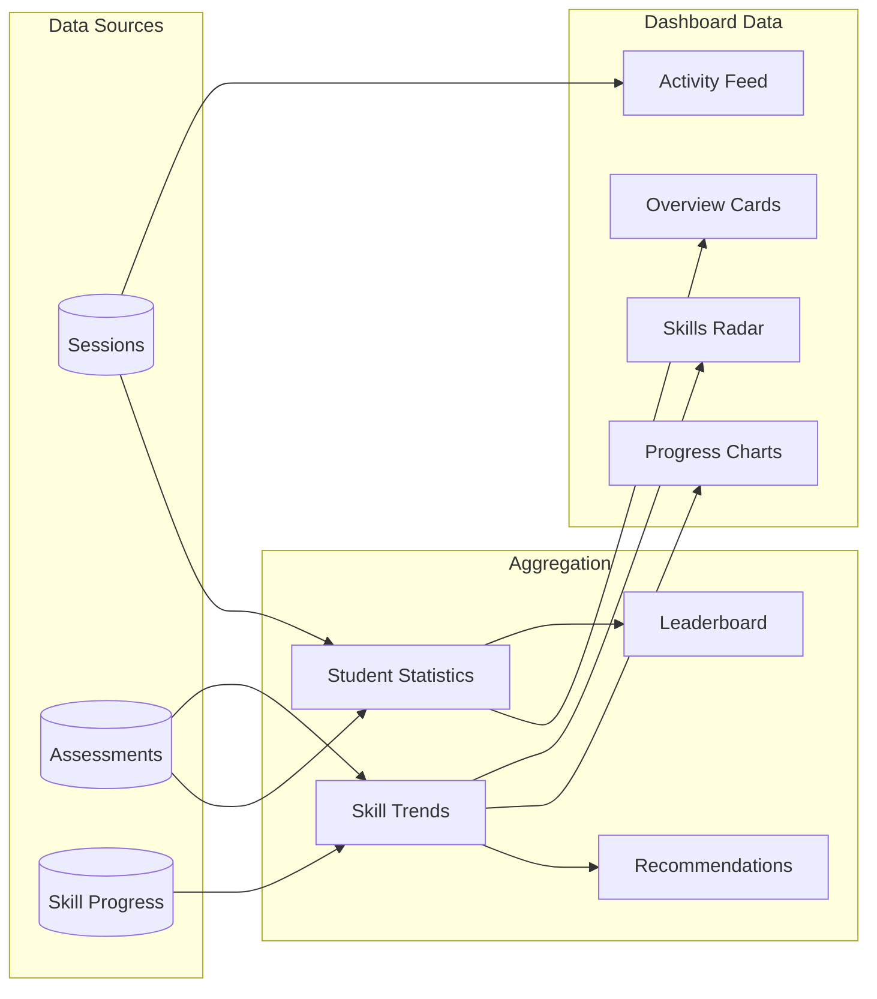
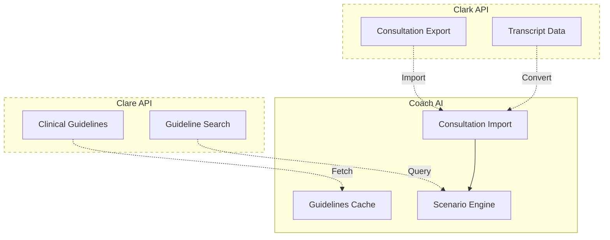
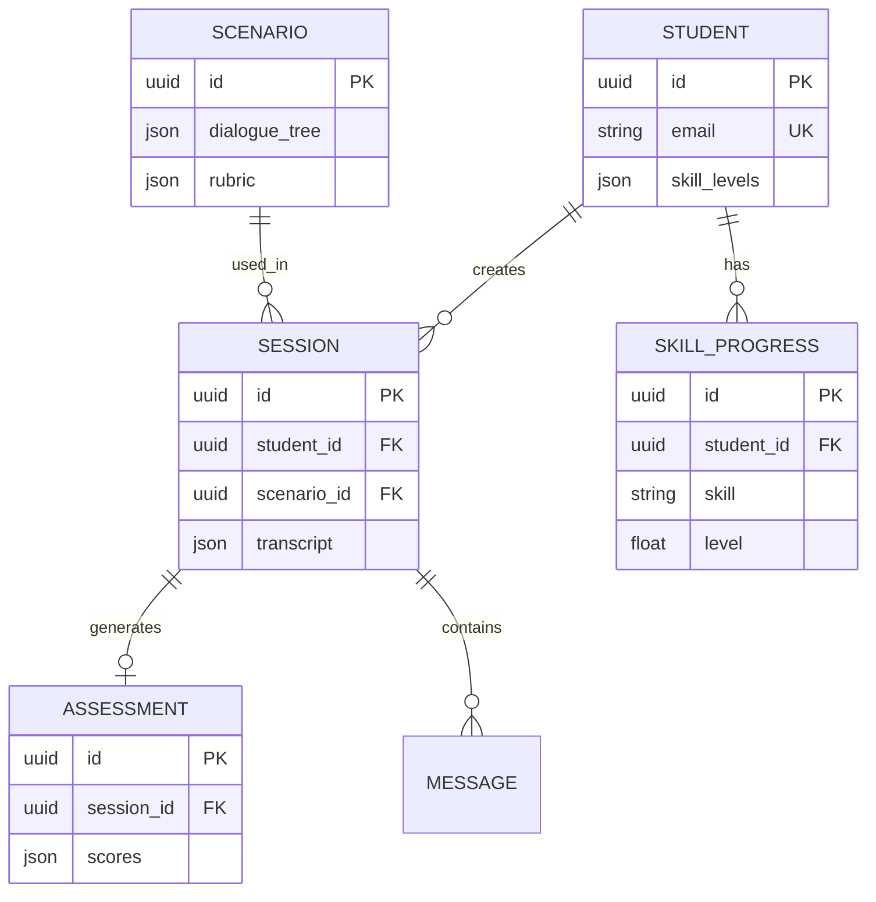

# Data Flow Diagrams

**Last Updated**: 2025-11-22

## Overview

This document illustrates how data flows through the Coach AI platform.

## End-to-End User Journey

## Real-Time Consultation Data Flow

## Voice Data Flow

### Text-to-Speech (TTS)

### Speech-to-Text (STT)

## Assessment Data Flow

## Analytics Data Aggregation

## External Integration Data Flow

## Data Model Relationships

