# Data Flow Diagrams

**Last Updated**: 2025-11-24

## Overview

This document illustrates how data flows through the Coach AI platform.

## UI Design Context

The Coach AI frontend uses a Clark-inspired design system:
- **Branding**: CoachLogo.svg in Header and Landing page
- **Color Theme**: Olive green (#669900) primary color
- **Typography**: Schibsted Grotesk font family
- **Layout**: Clark-style footer (text left, links right)

## End-to-End User Journey

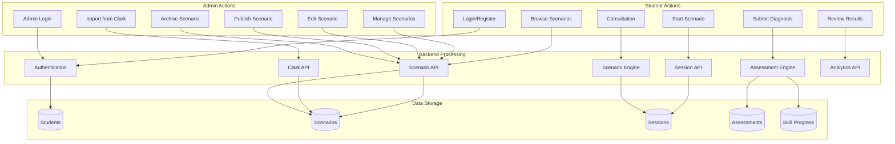

## Real-Time Consultation Data Flow

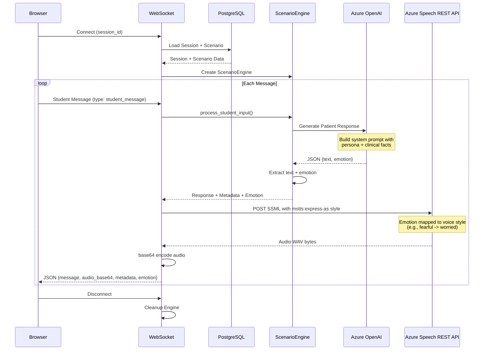

## Voice Data Flow

### Text-to-Speech (TTS)

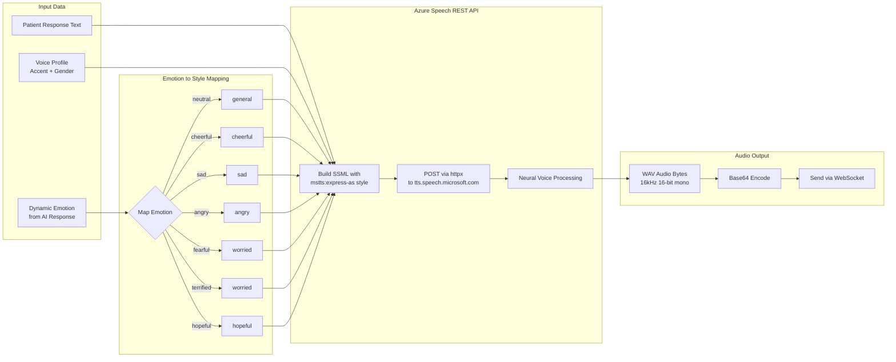

### Speech-to-Text (STT)

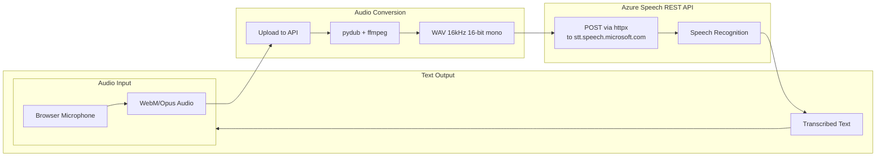

## Assessment Data Flow

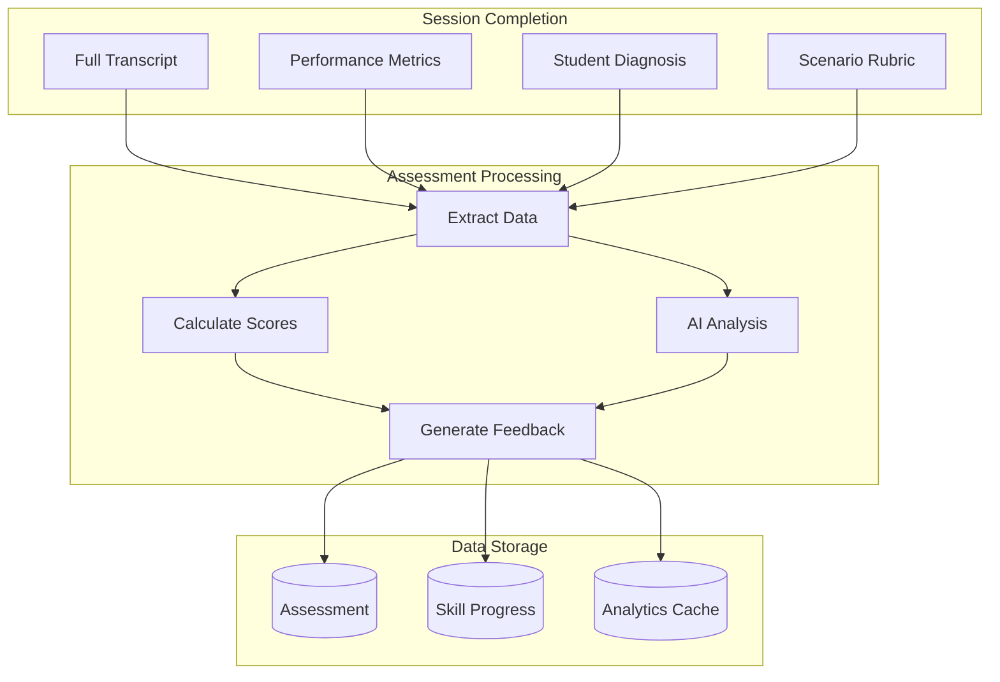

## Analytics Data Aggregation

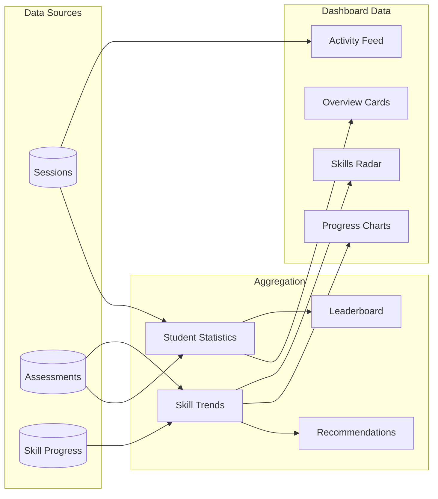

## External Integration Data Flow

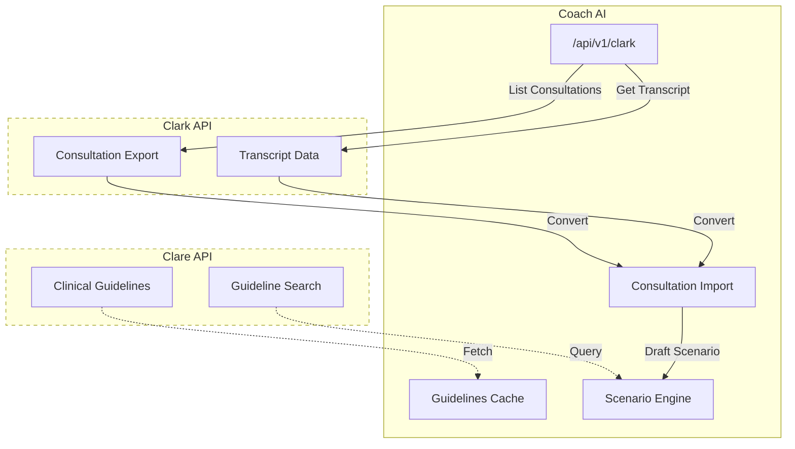

## AI Prompt & Emotion Data Flow

This section details how clinical knowledge is extracted and how emotions flow through the system.

### Clinical Knowledge Extraction

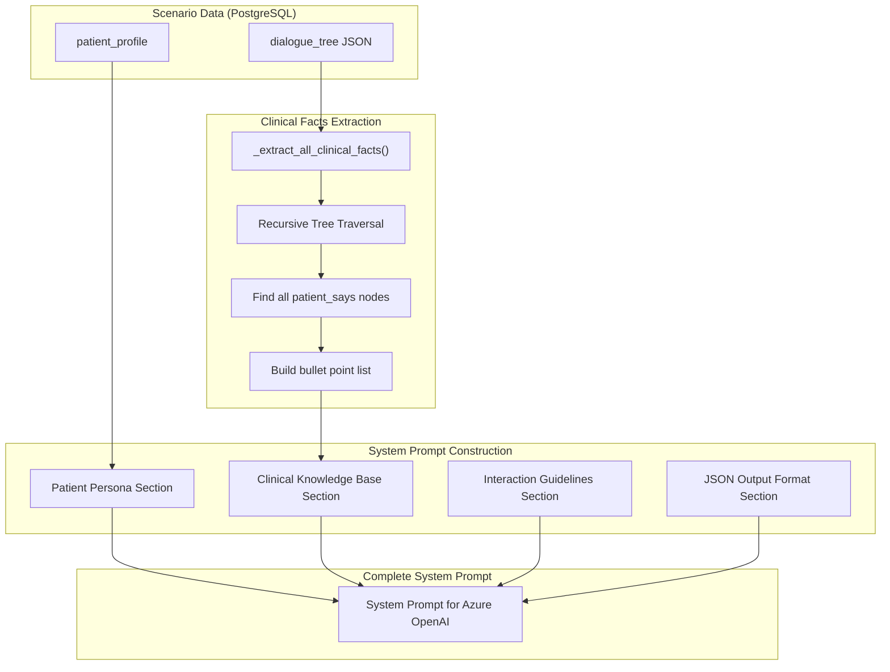

### Emotion Flow Through System

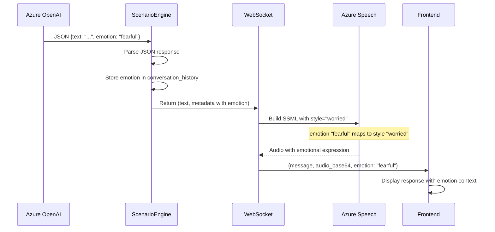

### Emotion Storage in Conversation History

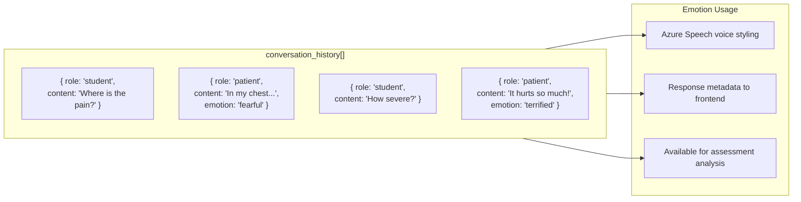

## Clark Import Data Flow

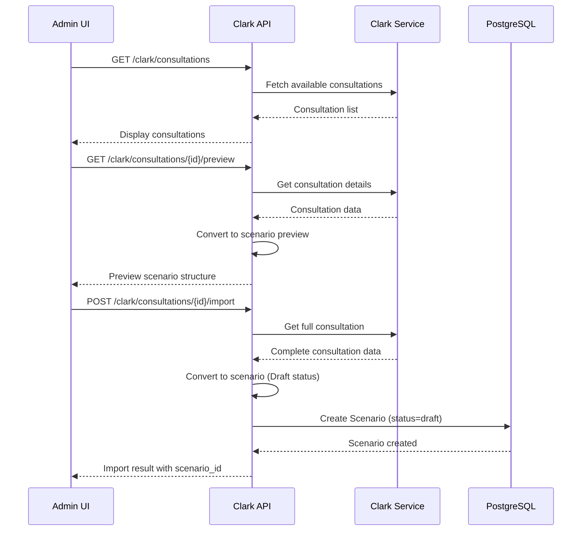

## Scenario Lifecycle Data Flow

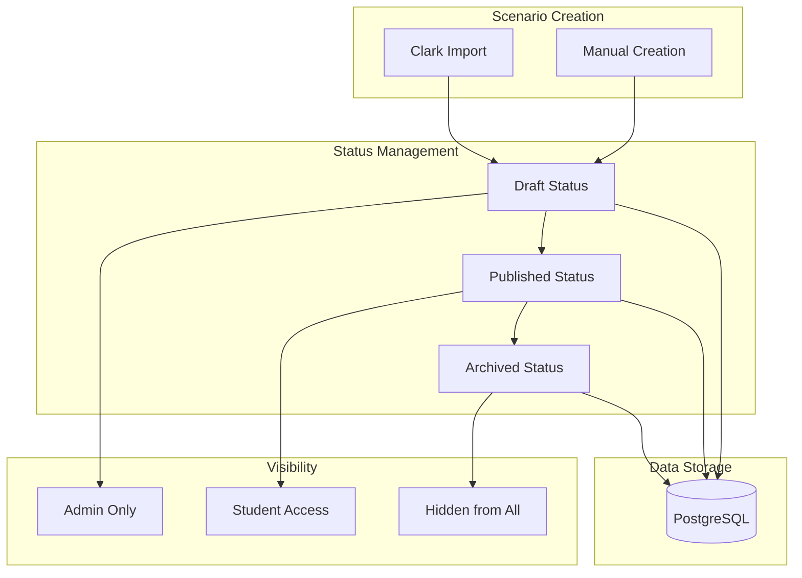

## Data Model Relationships

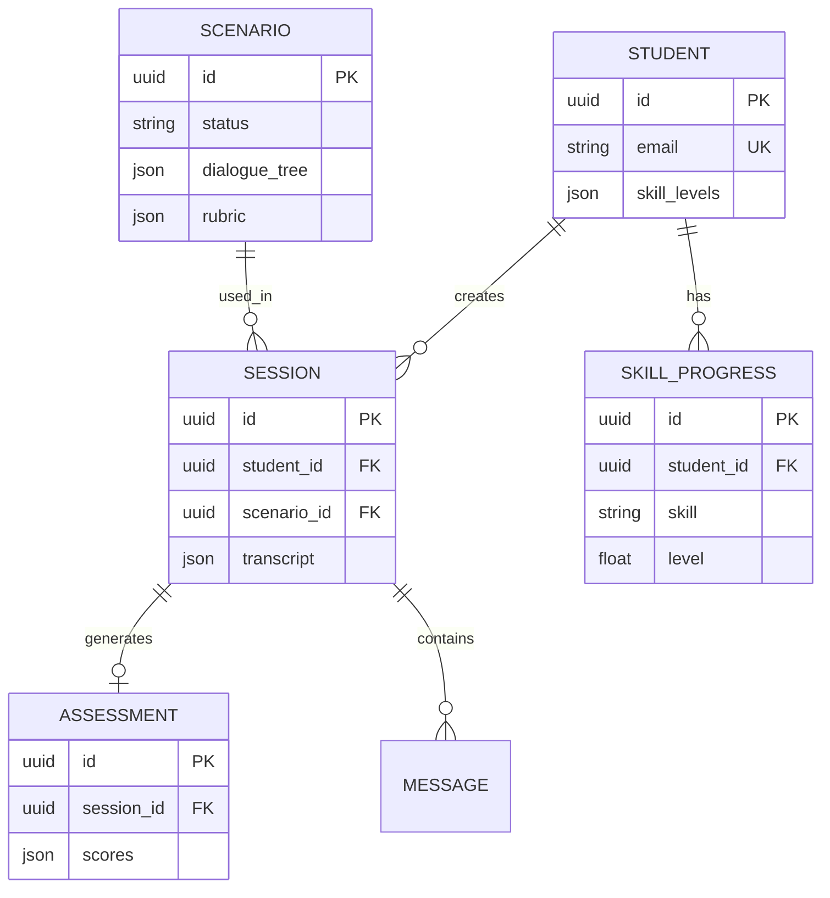
