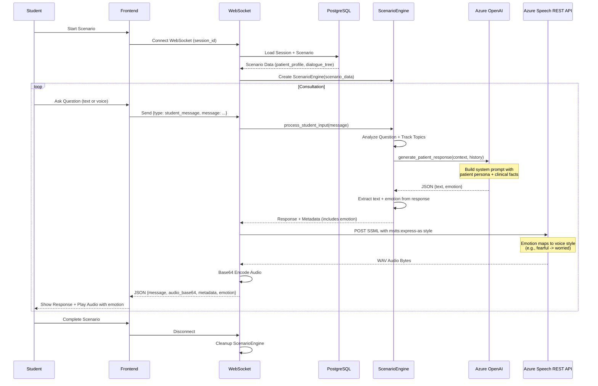
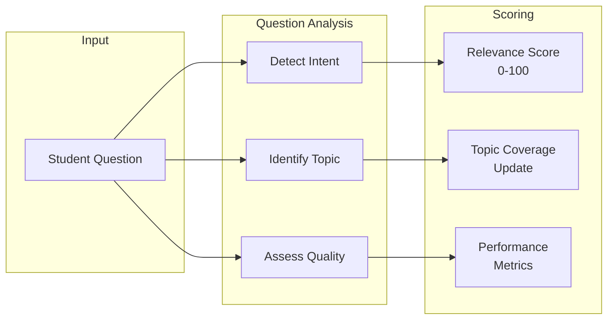
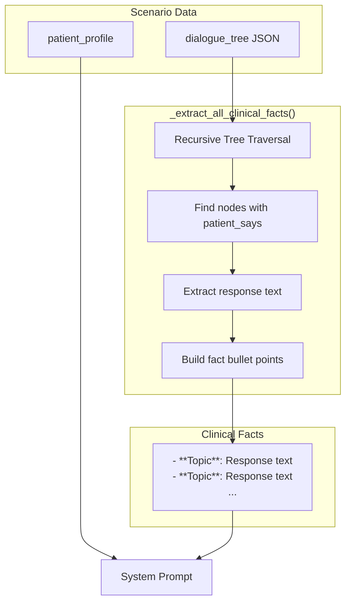
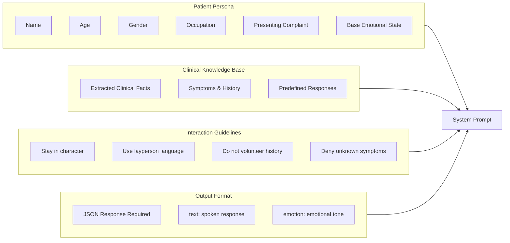
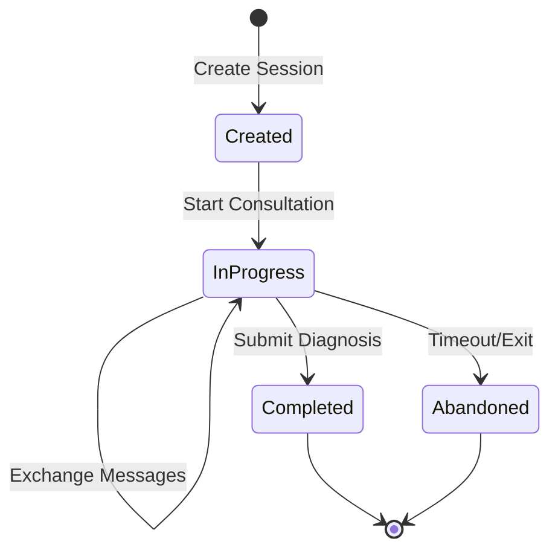
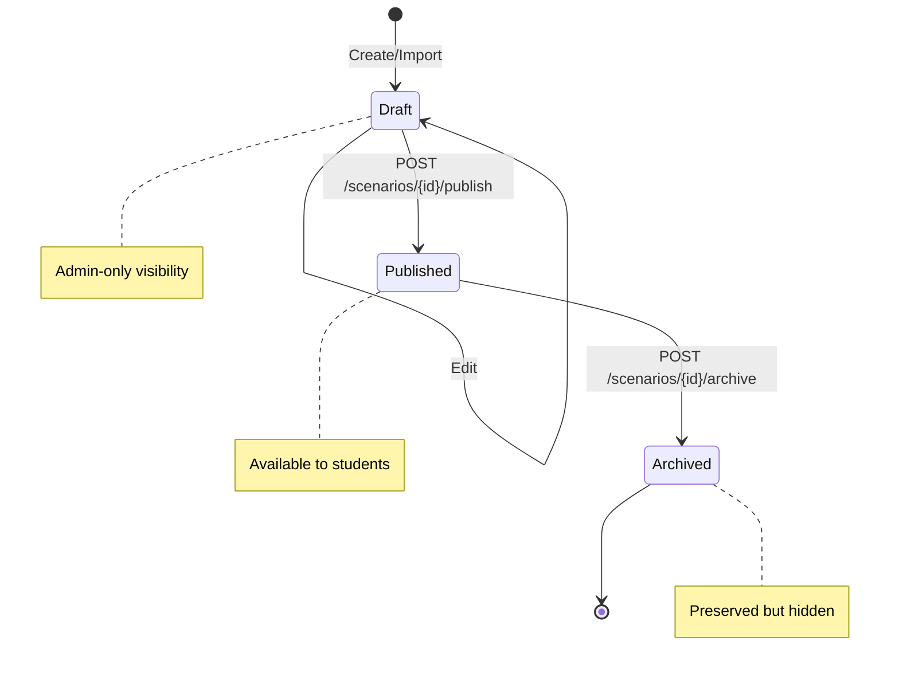
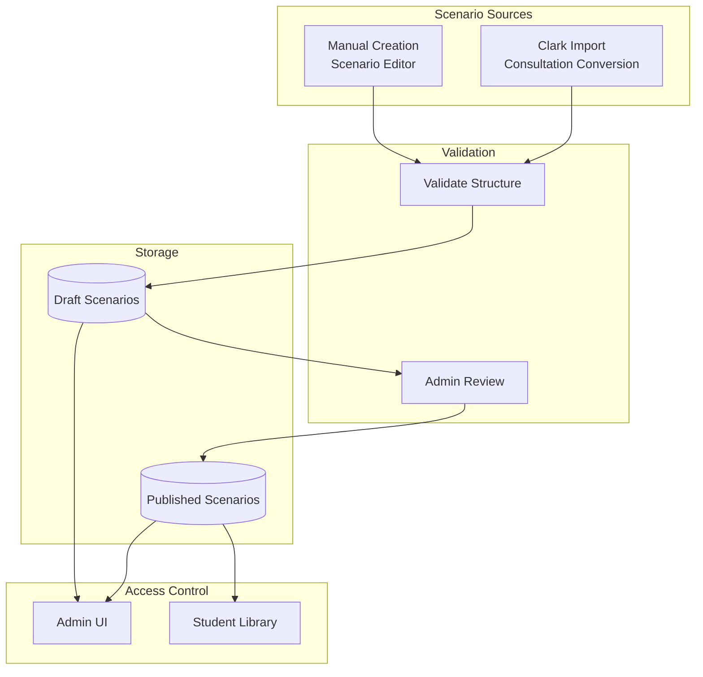

# Scenario Engine Flow

**Last Updated**: 2025-11-24

## Overview

The Scenario Engine manages interactive clinical consultations between students and AI-simulated patients. It features a dynamic AI Prompt & Emotion Engine that generates contextually-aware patient responses with real-time emotional expression.

## Consultation Flow



## Dialogue Tree Processing

```mermaid
flowchart TD
    Start([Student Question]) --> Analyze[Analyze Question]
    Analyze --> Relevance{Check Relevance}

    Relevance -->|High| Track[Track Topic Coverage]
    Relevance -->|Medium| Track
    Relevance -->|Low| Redirect[Redirect Response]

    Track --> RedFlag{Red Flag\nDetected?}
    RedFlag -->|Yes| MarkFlag[Mark Red Flag Found]
    RedFlag -->|No| Generate
    MarkFlag --> Generate

    Generate[Generate Patient Response]
    Redirect --> Generate

    Generate --> Context[Build Context with Clinical Facts]
    Context --> AI[Azure OpenAI\nJSON response_format]
    AI --> JSON[JSON Response\n{text, emotion}]

    JSON --> Text[Extract Text]
    JSON --> Emotion[Extract Emotion]

    Emotion -->|neutral| NeutralVoice[style: general]
    Emotion -->|cheerful| CheerfulVoice[style: cheerful]
    Emotion -->|sad| SadVoice[style: sad]
    Emotion -->|angry| AngryVoice[style: angry]
    Emotion -->|fearful| FearfulVoice[style: worried]
    Emotion -->|terrified| TerrifiedVoice[style: worried]
    Emotion -->|hopeful| HopefulVoice[style: hopeful]

    NeutralVoice --> SSML[Build SSML with mstts:express-as]
    CheerfulVoice --> SSML
    SadVoice --> SSML
    AngryVoice --> SSML
    FearfulVoice --> SSML
    TerrifiedVoice --> SSML
    HopefulVoice --> SSML

    SSML --> Speech[Azure Speech REST API\nPOST via httpx]
    Speech --> Audio[WAV Audio Bytes]
    Audio --> Base64[Base64 Encode]

    Text --> Output
    Base64 --> Output([Response + Audio via WebSocket])
```

## Question Analysis



## Topic Categories

| Category | Examples | Weight |
|----------|----------|--------|
| History of Presenting Complaint | Pain location, duration, severity | High |
| Past Medical History | Previous conditions, surgeries | Medium |
| Medications | Current medications, allergies | High |
| Social History | Smoking, alcohol, occupation | Medium |
| Family History | Hereditary conditions | Low |
| Systems Review | Other symptoms | Medium |
| Red Flags | Concerning symptoms | Critical |

## AI Prompt & Emotion Engine

The AI Prompt Engine builds comprehensive system prompts that enable realistic patient simulation with dynamic emotional responses.

### Clinical Knowledge Base Extraction



### System Prompt Structure



### Emotion System

The AI dynamically selects an emotion for each response based on the conversation context.

| Emotion | Description | Azure Voice Style |
|---------|-------------|-------------------|
| `neutral` | Normal, calm state | `general` |
| `cheerful` | Happy, positive | `cheerful` |
| `sad` | Unhappy, down | `sad` |
| `angry` | Frustrated, upset | `angry` |
| `fearful` | Worried, anxious | `worried` |
| `terrified` | Extreme fear | `worried` |
| `hopeful` | Optimistic | `hopeful` |
| `shouting` | Loud, urgent | `shouting` |
| `whispering` | Quiet, secretive | `whispering` |
| `unfriendly` | Cold, distant | `unfriendly` |

### JSON Response Format

The AI is configured to output JSON using `response_format={"type": "json_object"}`:

```json
{
  "text": "It hurts so much when I breathe!",
  "emotion": "terrified"
}
```

The `emotion` field is:
1. Extracted by `ScenarioEngine.process_student_input()`
2. Stored in conversation history
3. Passed to Azure Speech Services for voice styling
4. Returned to frontend in response metadata

## Session State Management



## Scenario Status Management

Scenarios follow a lifecycle that determines their visibility and availability to students.



## Scenario Creation Sources



## API Endpoints for Scenario Management

| Endpoint | Method | Description |
|----------|--------|-------------|
| `/api/v1/scenarios` | GET | List scenarios (filter by status) |
| `/api/v1/scenarios` | POST | Create new scenario (Draft status) |
| `/api/v1/scenarios/{id}` | GET | Get scenario details |
| `/api/v1/scenarios/{id}` | PUT | Update scenario |
| `/api/v1/scenarios/{id}` | DELETE | Delete scenario |
| `/api/v1/scenarios/{id}/publish` | POST | Publish scenario to students |
| `/api/v1/scenarios/{id}/archive` | POST | Archive scenario |
| `/api/v1/clark/consultations` | GET | List available Clark consultations |
| `/api/v1/clark/consultations/{id}/preview` | GET | Preview scenario conversion |
| `/api/v1/clark/consultations/{id}/import` | POST | Import as Draft scenario |
