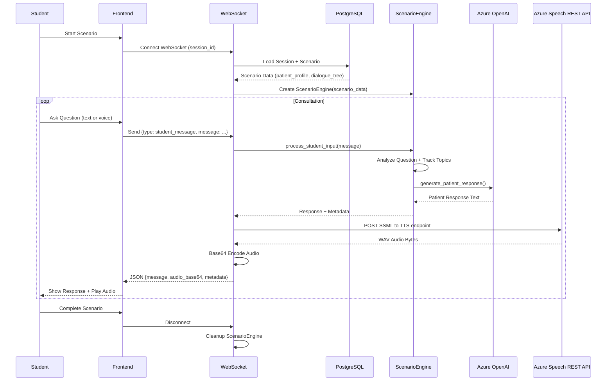
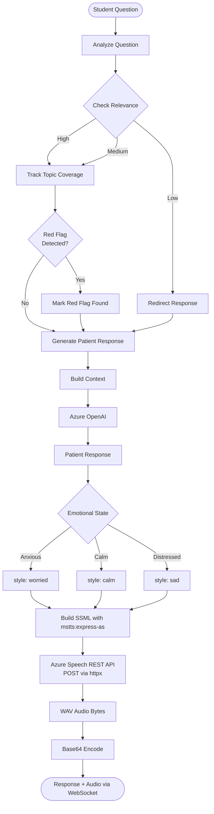
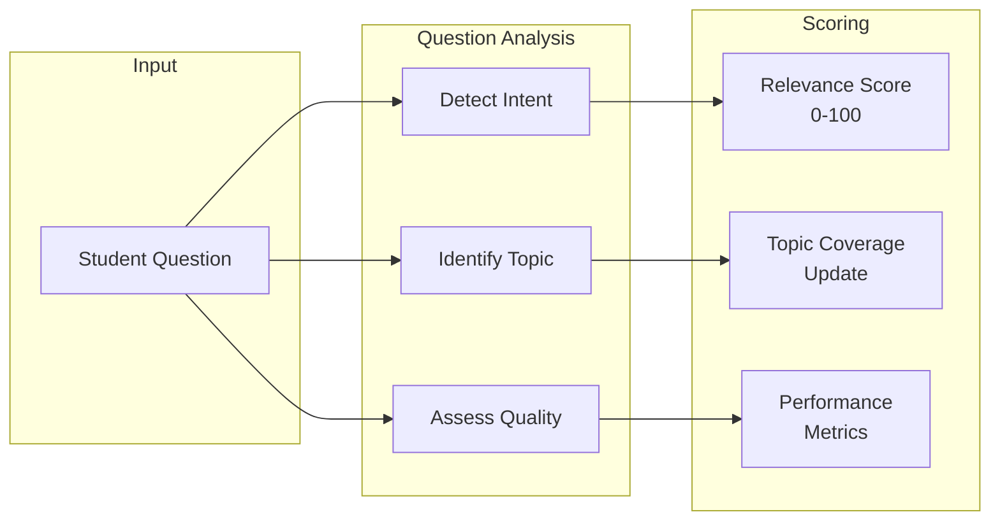
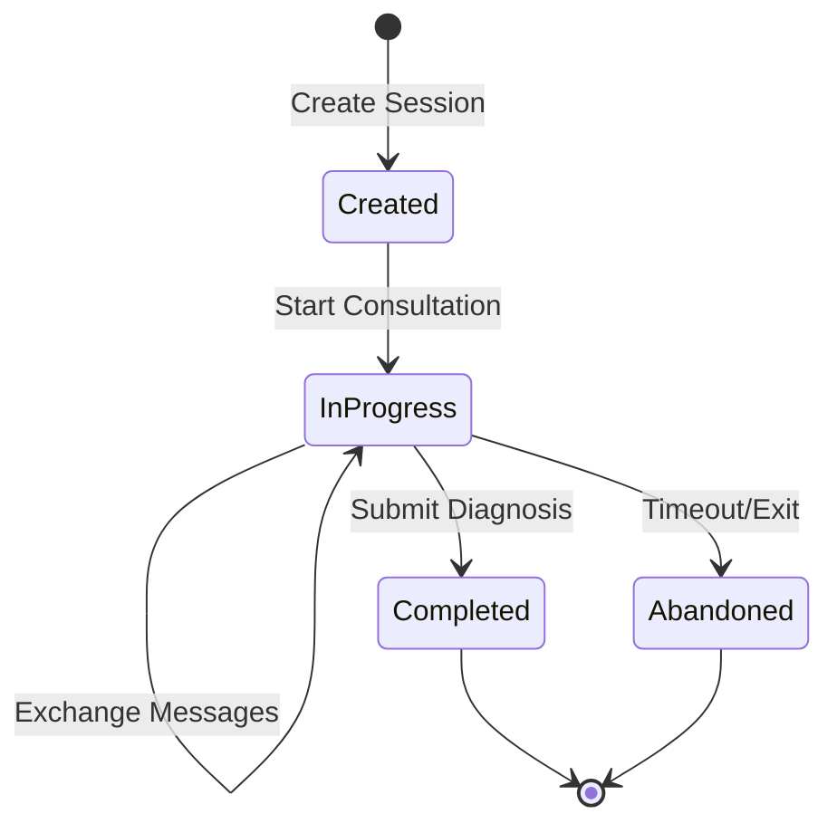
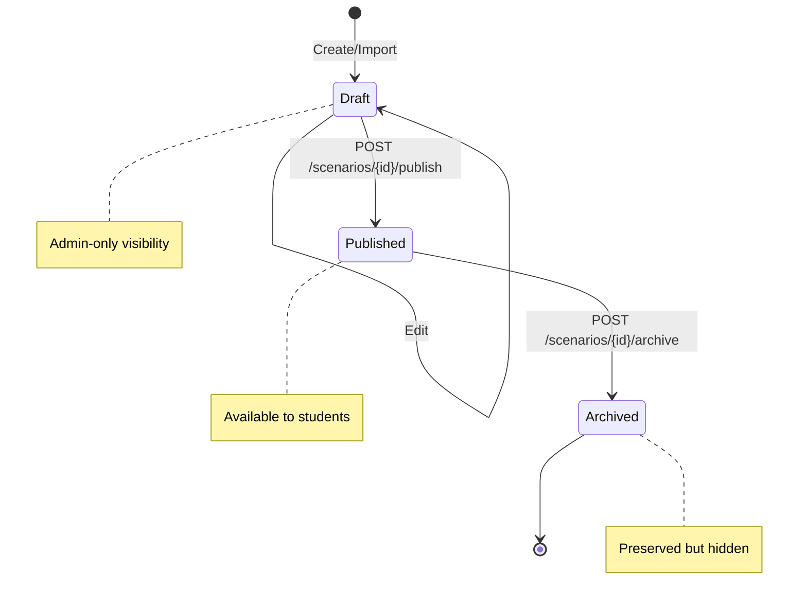
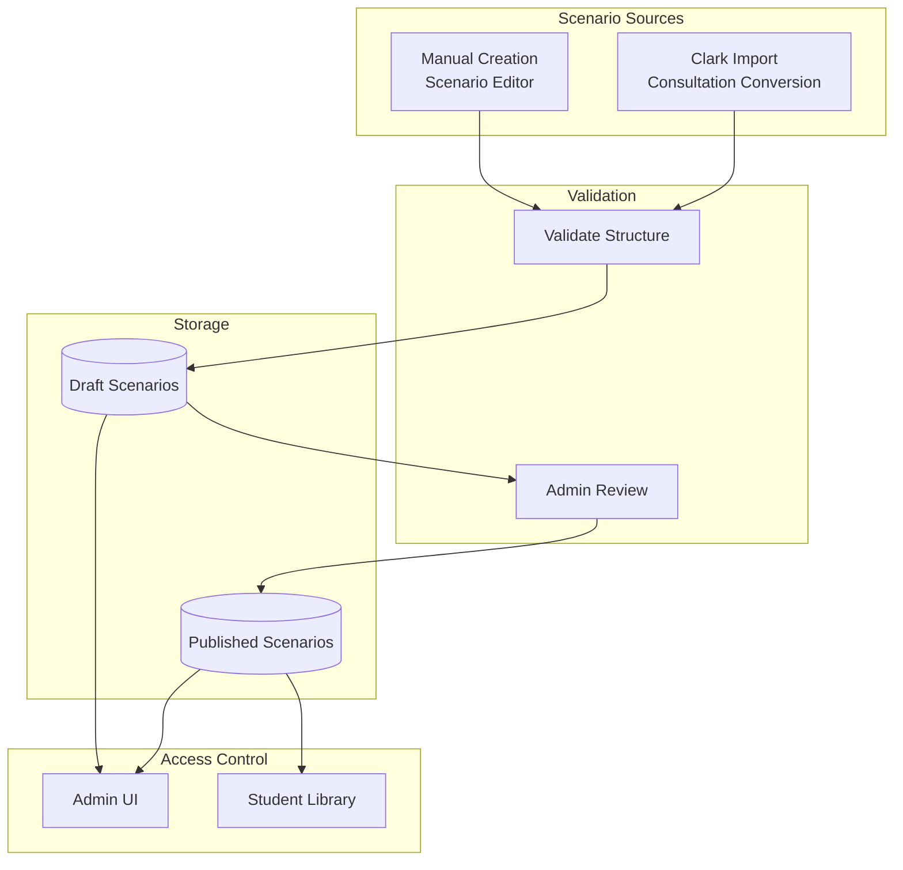

# Scenario Engine Flow

**Last Updated**: 2025-11-23

## Overview

The Scenario Engine manages interactive clinical consultations between students and AI-simulated patients.

## Consultation Flow

## Dialogue Tree Processing

## Question Analysis

## Topic Categories

| Category | Examples | Weight |
|----------|----------|--------|
| History of Presenting Complaint | Pain location, duration, severity | High |
| Past Medical History | Previous conditions, surgeries | Medium |
| Medications | Current medications, allergies | High |
| Social History | Smoking, alcohol, occupation | Medium |
| Family History | Hereditary conditions | Low |
| Systems Review | Other symptoms | Medium |
| Red Flags | Concerning symptoms | Critical |

## Session State Management

## Scenario Status Management

Scenarios follow a lifecycle that determines their visibility and availability to students.

## Scenario Creation Sources

## API Endpoints for Scenario Management

| Endpoint | Method | Description |
|----------|--------|-------------|
| `/api/v1/scenarios` | GET | List scenarios (filter by status) |
| `/api/v1/scenarios` | POST | Create new scenario (Draft status) |
| `/api/v1/scenarios/{id}` | GET | Get scenario details |
| `/api/v1/scenarios/{id}` | PUT | Update scenario |
| `/api/v1/scenarios/{id}` | DELETE | Delete scenario |
| `/api/v1/scenarios/{id}/publish` | POST | Publish scenario to students |
| `/api/v1/scenarios/{id}/archive` | POST | Archive scenario |
| `/api/v1/clark/consultations` | GET | List available Clark consultations |
| `/api/v1/clark/consultations/{id}/preview` | GET | Preview scenario conversion |
| `/api/v1/clark/consultations/{id}/import` | POST | Import as Draft scenario |
