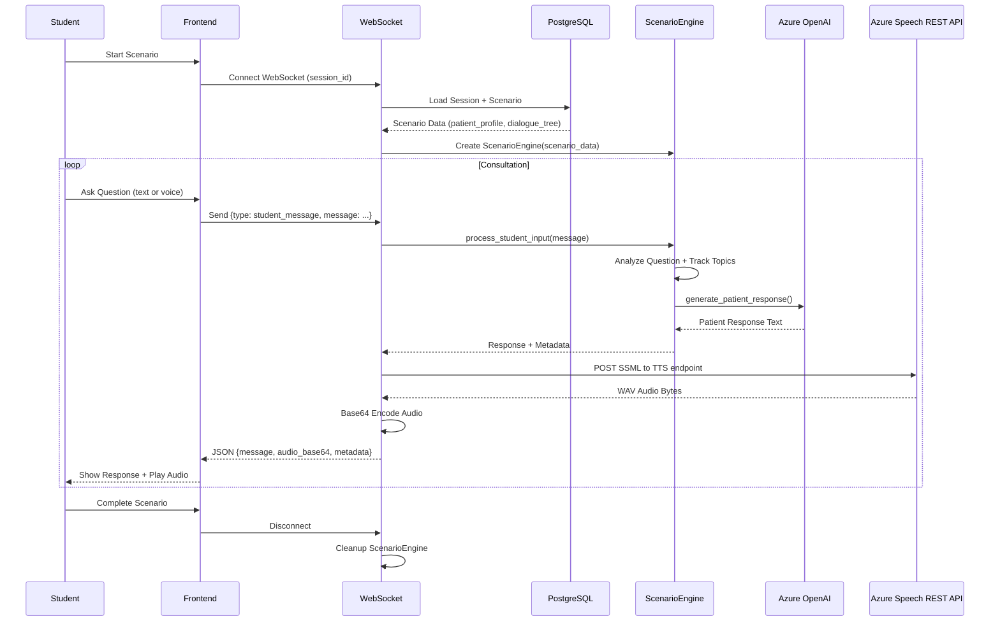
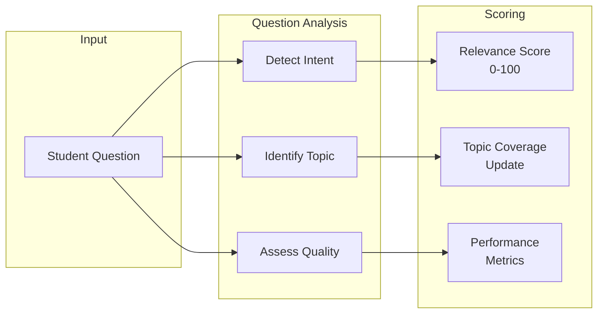
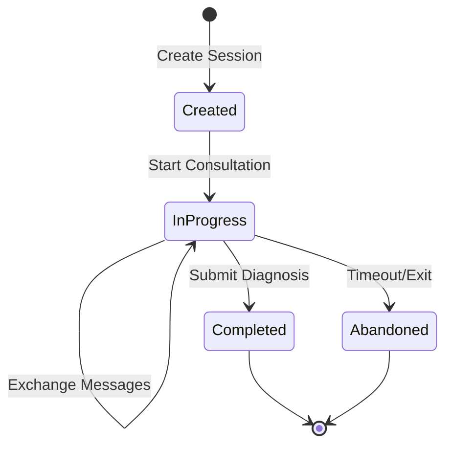

# Scenario Engine Flow

**Last Updated**: 2025-11-22

## Overview

The Scenario Engine manages interactive clinical consultations between students and AI-simulated patients.

## Consultation Flow

## Dialogue Tree Processing

## Question Analysis

## Topic Categories

| Category | Examples | Weight |
|----------|----------|--------|
| History of Presenting Complaint | Pain location, duration, severity | High |
| Past Medical History | Previous conditions, surgeries | Medium |
| Medications | Current medications, allergies | High |
| Social History | Smoking, alcohol, occupation | Medium |
| Family History | Hereditary conditions | Low |
| Systems Review | Other symptoms | Medium |
| Red Flags | Concerning symptoms | Critical |

## Session State Management

